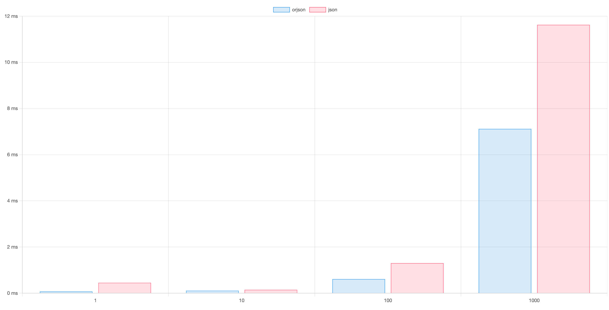

# README

json과 orjson의 사용성능 비교하기위해 테스트코드를 작성하였습니다.

pydantic.BaseModel을 상속한 데이터클래스에 유니코드를 포함한 임의의 데이터를 입력하는 방식으로

1개부터 1000개까지 생성하고 json, orjson으로 직렬화합니다.

각 테스트코드에서 직렬화에 소요되는 시간을 측정한 뒤 별도의 json 파일에 기록한 뒤, 도식화된 결과를 확인합니다.

측정된 시간은 ms(milliseconds) 단위로 기록됩니다.

## 테스트 수행

```bash
❯ make test
Running tests locally
============================================================== test session starts ===============================================================
platform linux -- Python 3.10.14, pytest-7.4.4, pluggy-1.5.0
rootdir: /d3fau1t/workshop
plugins: Faker-20.1.0, asyncio-0.21.2, order-1.2.1
asyncio: mode=strict
collected 10 items

tests/test_1_prepare_post.py::test_save_post_as_pickle PASSED                                                                              [ 10%]
tests/test_2_json_serialize.py::test_1_post_serialize 
----------------------------------------------------------------- live log call ------------------------------------------------------------------
INFO     root:test_2_json_serialize.py:18 [json.dumps] progress time: 6.651878356933594e-05
INFO     root:test_2_json_serialize.py:19 [json.dumps] <<class 'dict'>: {'0': '{"title": "At cum delectus rem libero cupiditate.", "content": "Illo labore officia illo adipisci itaque. Aliquam et ducimus laboriosam repellat facere. Reprehenderit debitis voluptatum. Inventore dolorum culpa nesciunt.", "created_at": "1978-05-21T04:41:57.304001", "updated_at": "2003-01-03T02:27:15.188765", "deactivated_at": null, "deactivated": false, "published": false, "author": {"name": "\\ubc30\\uc608\\uc6d0", "email": "gimgyeongja@example.com", "password": "D!Xrz0uj$3"}, "categories": ["sint", "natus", "at"], "tags": ["distinctio", "consectetur", "nesciunt"]}'}>
PASSED                                                                                                                                     [ 20%]
tests/test_3_orjson_serialize.py::test_1_post_serialize 
----------------------------------------------------------------- live log call ------------------------------------------------------------------
INFO     root:test_3_orjson_serialize.py:21 [orjson.dumps] progress time: 1.5020370483398438e-05
INFO     root:test_3_orjson_serialize.py:22 orjson.dumps: <<class 'dict'>: {'0': b'{"title":"At cum delectus rem libero cupiditate.","content":"Illo labore officia illo adipisci itaque. Aliquam et ducimus laboriosam repellat facere. Reprehenderit debitis voluptatum. Inventore dolorum culpa nesciunt.","created_at":"1978-05-21T04:41:57.304001","updated_at":"2003-01-03T02:27:15.188765","deactivated_at":null,"deactivated":false,"published":false,"author":{"name":"\xeb\xb0\xb0\xec\x98\x88\xec\x9b\x90","email":"gimgyeongja@example.com","password":"D!Xrz0uj$3"},"categories":["sint","natus","at"],"tags":["distinctio","consectetur","nesciunt"]}'}>
PASSED                                                                                                                                     [ 30%]
tests/test_2_json_serialize.py::test_10_post_serialize 
----------------------------------------------------------------- live log call ------------------------------------------------------------------
INFO     root:test_2_json_serialize.py:28 [json.dumps] progress time: 9.441375732421875e-05
PASSED                                                                                                                                     [ 40%]
tests/test_3_orjson_serialize.py::test_10_post_serialize 
----------------------------------------------------------------- live log call ------------------------------------------------------------------
INFO     root:test_3_orjson_serialize.py:31 [orjson.dumps] progress time: 4.076957702636719e-05
PASSED                                                                                                                                     [ 50%]
tests/test_2_json_serialize.py::test_100_post_serialize 
----------------------------------------------------------------- live log call ------------------------------------------------------------------
INFO     root:test_2_json_serialize.py:37 [json.dumps] progress time: 0.0009796619415283203
PASSED                                                                                                                                     [ 60%]
tests/test_3_orjson_serialize.py::test_100_post_serialize 
----------------------------------------------------------------- live log call ------------------------------------------------------------------
INFO     root:test_3_orjson_serialize.py:40 [orjson.dumps] progress time: 0.0002701282501220703
PASSED                                                                                                                                     [ 70%]
tests/test_2_json_serialize.py::test_1000_post_serialize 
----------------------------------------------------------------- live log call ------------------------------------------------------------------
INFO     root:test_2_json_serialize.py:46 [json.dumps] progress time: 0.006943702697753906
PASSED                                                                                                                                     [ 80%]
tests/test_3_orjson_serialize.py::test_1000_post_serialize 
----------------------------------------------------------------- live log call ------------------------------------------------------------------
INFO     root:test_3_orjson_serialize.py:49 [orjson.dumps] progress time: 0.005162477493286133
PASSED                                                                                                                                     [ 90%]
tests/test_4_compare_serialized_data.py::test_deserialize_and_compare PASSED                                                               [100%]

=============================================================== 10 passed in 0.40s ===============================================================
```

## 결과

### json

```json
{
  "1": 0.45418739318847656,
  "10": 0.14901161193847656,
  "100": 1.3039112091064453,
  "1000": 11.626958847045898
}
```

### json.dumps(post.model_dump())

```python
{
  '0': '{"title": "Illo temporibus quas natus dignissimos exercitationem.", "content": "Corporis dolore possimus ipsam exercitationem fuga aut.\\nBeatae quaerat blanditiis error non corporis incidunt. Rem consequatur quam quae quo nostrum. Fugiat ea veritatis nulla illum excepturi.", "created_at": "2022-07-19T15:18:42.869621", "updated_at": "2014-09-30T08:11:47.635847", "deactivated_at": null, "deactivated": false, "published": false, "author": {"name": "\\uc548\\uc815\\ub0a8", "email": "ihayun@example.org", "password": "&72m09Xi)a"}, "categories": ["quasi", "sit", "cumque"], "tags": ["fuga", "quae", "placeat"]}'
}
```

dict 안에 들어있는 value가 string으로 변환되었음

## orjson

```json
{
  "1": 0.07295608520507812,
  "10": 0.11110305786132812,
  "100": 0.6127357482910156,
  "1000": 7.117271423339844
}
```

### orjson.dumps(post.model_dump())

```python
{
  '0': b'{"title":"Illo temporibus quas natus dignissimos exercitationem.","content":"Corporis dolore possimus ipsam exercitationem fuga aut.\\nBeatae quaerat blanditiis error non corporis incidunt. Rem consequatur quam quae quo nostrum. Fugiat ea veritatis nulla illum excepturi.","created_at":"2022-07-19T15:18:42.869621","updated_at":"2014-09-30T08:11:47.635847","deactivated_at":null,"deactivated":false,"published":false,"author":{"name":"\xec\x95\x88\xec\xa0\x95\xeb\x82\xa8","email":"ihayun@example.org","password":"&72m09Xi)a"},"categories":["quasi","sit","cumque"],"tags":["fuga","quae","placeat"]}'
}
```

dict 안에 들어있는 value가 bytes로 변환되었음

## 도식화



## 데이터 동기화

작성된 테스트코드의 실행결과와 [test_4_compare_serialized_data.py](tests/test_4_compare_serialized_data.py)에 명시해둔 부분을 확인하면 알 수 있듯이

json.dumps()와 orjson.dumps()로 직렬화된 데이터는 서로 다른 형태를 가지고 있습니다.

하지만 각각의 직렬화된 데이터를 json.loads()와 orjson.loads()로 역직렬화한 데이터는 서로 같은 형태를 가지고 있습니다.

그렇기 때문에 기존에 json.dumps()로 직렬화된 데이터를 orjson.loads()로 역직렬화해도 문제가 없습니다.

```python
>> from_json_dumps = '{"title": "Illo temporibus quas natus dignissimos exercitationem.", "content": "Corporis dolore possimus ipsam exercitationem fuga aut.\\nBeatae quaerat blanditiis error non corporis incidunt. Rem consequatur quam quae quo nostrum. Fugiat ea veritatis nulla illum excepturi.", "created_at": "2022-07-19T15:18:42.869621", "updated_at": "2014-09-30T08:11:47.635847", "deactivated_at": null, "deactivated": false, "published": false, "author": {"name": "\\uc548\\uc815\\ub0a8", "email": "ihayun@example.org", "password": "&72m09Xi)a"}, "categories": ["quasi", "sit", "cumque"], "tags": ["fuga", "quae", "placeat"]}'

>> from_orjson_dumps = b'{"title":"Illo temporibus quas natus dignissimos exercitationem.","content":"Corporis dolore possimus ipsam exercitationem fuga aut.\\nBeatae quaerat blanditiis error non corporis incidunt. Rem consequatur quam quae quo nostrum. Fugiat ea veritatis nulla illum excepturi.","created_at":"2022-07-19T15:18:42.869621","updated_at":"2014-09-30T08:11:47.635847","deactivated_at":null,"deactivated":false,"published":false,"author":{"name":"\xec\x95\x88\xec\xa0\x95\xeb\x82\xa8","email":"ihayun@example.org","password":"&72m09Xi)a"},"categories":["quasi","sit","cumque"],"tags":["fuga","quae","placeat"]}'

>> from_json_dumps == from_orjson_dumps
False

>> import json
>> import orjson

>>> orjson.loads(from_json_dumps) == orjson.loads(from_orjson_dumps)
True
>>> orjson.loads(from_json_dumps) == json.loads(from_json_dumps)
True
>>> orjson.loads(from_json_dumps) == json.loads(from_orjson_dumps)
True
>>> orjson.loads(from_orjson_dumps) == json.loads(from_json_dumps)
True
>>> orjson.loads(from_orjson_dumps) == json.loads(from_orjson_dumps)
True
>>> json.loads(from_json_dumps) == json.loads(from_orjson_dumps)
True
```
